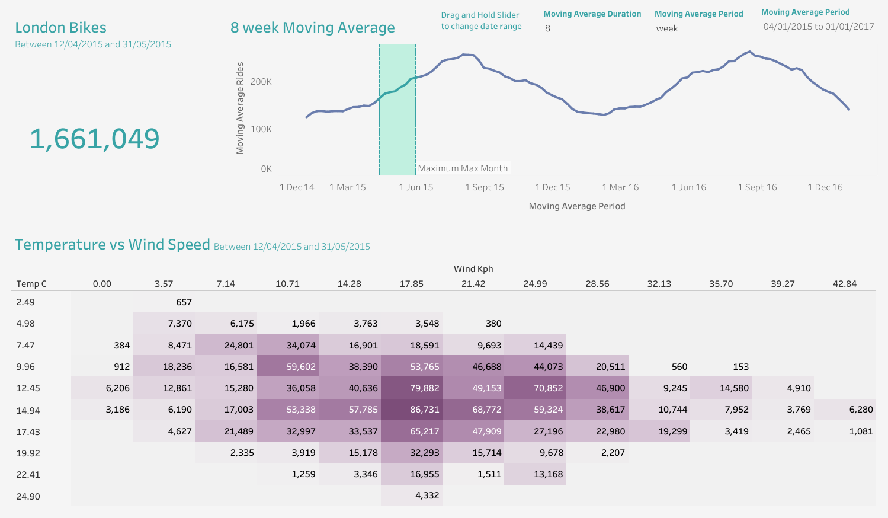
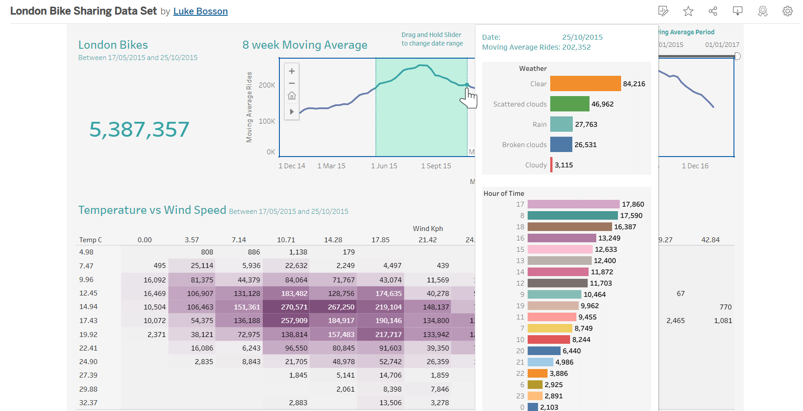

# London Bike Sharing Project

## Objectives
**1.** Programatically gather data

**2.** Explore, assess and manipulate the data using the pandas library in Python

**3.** Create impactful visualisations in Tableau

## Data source via Kaggle
- [london-bike-sharing-dataset](https://www.kaggle.com/datasets/hmavrodiev/london-bike-sharing-dataset)
- Via Uk Govt: [Https://cycling.data.tfl.gov.uk/]

## Metadata
Python dictionaries were made using the following metadata and referenced to make new columns in bike dataset:
- "timestamp" - timestamp field for grouping the data
- "cnt" - the count of a new bike shares
- "t1" - real temperature in C
- "t2" - temperature in C "feels like"
- "hum" - humidity in percentage
- "wind_speed" - wind speed in km/h
- "weather_code" - category of the weather
- "is_holiday" - boolean field - 1 holiday / 0 non holiday
- "is_weekend" - boolean field - 1 if the day is weekend
- "season" - category field meteorological seasons: 0-spring ; 1-summer; 2-fall; 3-winter
- "weathe_code" category description:
1 = Clear ; mostly clear but have some values with haze/fog/patches of fog/ fog in vicinity 2 = scattered clouds / few clouds 3 = Broken clouds 4 = Cloudy 7 = Rain/ light Rain shower/ Light rain 10 = rain with thunderstorm 26 = snowfall 94 = Freezing Fog

# Analysis
## Tableau Dashboard
### 5 visualizations
Highlighting data with most valuable insights
- **Total Bike Rides Count** (To understand sample size)
- **Moving Averages chart** (To guage the most recent riding trends)
    - **Rides split by weather and hour**
        - This graph is only presented when interacting with Moving averages line graph
- **Temperature vs Windspeed heatmap** (to discover how weather influences riding frequencies)
    - **Rides split by weather and hour**
            - This graph is only presented when interacting with heatmap
- **User Defined parameters**
    - Filtering data for specific time periods to explore moving averages
*Interactive graphs were added so the initial dashboard not crowded with information, consequently is easily interpretable. For stakeholders convenience the interactive graphs add the ability to dive deeper into the details while referencing the main graphs*

[My London Bike Sharing Data Dashboard](https://public.tableau.com/views/LondonBikeSharingDataSet/LondonBikeShare?:language=en-GB&:sid=9CBC8CE109EF4E6E80D7873A92AD0D6C-0:0&:display_count=n&:origin=viz_share_link) 

Interactive Display using Tableau's 'tooltip' feature

## Bike Sharing User Activity and Weather Trends

This report analyzes user activity in London's bike sharing program and its correlation with weather conditions.

### Seasonal Trends
- A strong correlation between weather and bike usage is evident on the interactive heatmap.
- Bike usage is highest in spring and summer, aligning with better weather conditions.
- Conversely, usage is very low during fall and winter months.

### Year-over-Year Trends
- The heatmap analysis reveals consistent bike sharing activity across the years studied, with no significant increase or decrease.

### Weather Impact
- The heatmap indicates significantly higher activity during specific weather conditions:
  - Wind speeds between 7.15 - 24.99 kph
  - Temperatures between 9.96 - 19.92 °C

### Cloud Cover Preference
- The moving average line graph suggests cyclists favor clear or varied cloud cover conditions, regardless of the season.

### Impact of Weather on Seasonality (Assumption)
- Assuming London did not experience a dry year, this data strongly suggests users prefer cycling in summer-like weather over winter conditions.

### Peak Biking Periods
- Peak biking periods tend to fall within two timeframes:
  - Between 07:00-09:00
  - Between 17:00-20:00

### Rush Hour Correlation
- This data aligns with higher bike sharing activity during rush hours.

## Future Analysis Recommendations
- To gain a more granular understanding of user behavior, analyzing individual user activity would be beneficial.
- This analysis could reveal patterns across the week:
  - Identifying consistently active riders
  - Determining if weather and other factors (laziness, working from home) influence individual riding habits

### Application
Conducting further analysis would depend on the clients needs. Consequently what types of Businesses would find this data useful? 
### Health companies
Understanding fitness levels and health needs of the population
- Distances travelled
- Demographic: Age, gender, race
- Qualitative data regardings peoples reasons to not walk or bike to work (driving kids to school on the way to work, feeling unsafe etc.)
### Bike Companies:
- retail (brick and mortar)
- rental services (lime scooters & bikes) 
#### Retail (brick and mortar) and Rental services (lime scooters & bikes)
Bike companies will find value in data related to targeting the right market
- Biking hotspots in london
- Typical routes 
- Data for other transport methods
    - i.e. trains and cars/ taxis, trying to acquire these users or create transport styles that incorporate some form of passive fitness